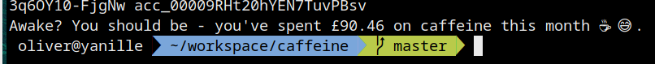

# caffeine
Find out how much you've spent on coffee so far this month.

You'll need a Monzo access token and your account id. Find them here: https://developers.monzo.com/api/playground

## Deps
* jq - https://stedolan.github.io/jq/
* bc - (B)asic (C)alculator
* curl
* sed

## Usage

`$ MONZO_TOKEN=xxx MONZO_ACCOUNT_ID=xxx ./caffeine.sh`
